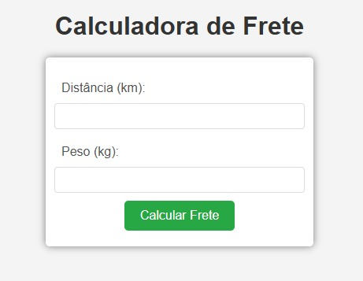

# Calculadora de Frete Simples. 🔢🚚

<a href=""> Clique aqui</a> para acessar a Calculadora.

---

### Sobre o Projeto.

Este projeto é uma Calculadora de Fretes desenvolvida em JavaScript, com uma interface simples e intuitiva criada em HTML e CSS. A calculadora permite aos usuários calcular o custo de frete com base na distância e no peso do pacote, demonstrando conceitos fundamentais de funções e eventos em JavaScript.

Para testar mais alguns conhecimentos, acrescentei a estilização na calculadora e também nos resultados. Criei um arquivo .CSS e adicionei mais alguns códigos no HTML e no JavaScript . 🚀📚💻

---

### Funcionalidades

<strong> Cálculo de Frete: </strong> O usuário insere a distância (em km) e o peso (em kg) do pacote, e a calculadora retorna o custo total do frete.

<strong> Interface Intuitiva: </strong> Uma interface amigável que facilita a inserção de dados e a visualização do resultado.

<strong> Estilo Moderno: </strong> Utilização de CSS para um design limpo e moderno, tornando a experiência do usuário agradável.

---

### Tecnologias Utilizadas

<strong> HTML5:</strong> Estrutura do projeto.

<strong> CSS3:</strong> Estilização da interface.

<strong> JavaScript:</strong> Lógica de cálculo e manipulação de eventos.

---

#### Contribuição
Se você deseja contribuir com este projeto, sinta-se à vontade para fazer um fork do repositório, criar uma branch, adicionar suas mudanças e abrir um pull request.

#### Licença
Este projeto está licenciado sob a MIT License - veja o arquivo LICENSE para mais detalhes.

---

### Autor

- 🦁
- [Wallax Figueiredo](https://www.linkedin.com/in/wallax-figueiredo-41116b285/)